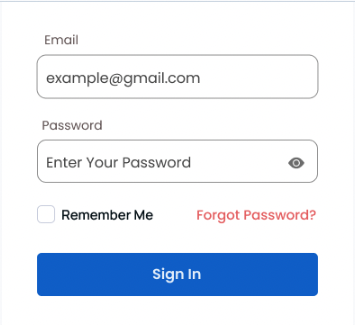

# Web Applications

[][1]

The goal of these programming exercises is to practise:
- working with a web server
- working with a web client
- creating simple HTML pages

## :globe_with_meridians: HTTP

**<ins>Exercise 1</ins>**

Complete a Java class that constructs [HttpRequest](https://docs.oracle.com/en/java/javase/21/docs/api/java.net.http/java/net/http/HttpRequest.html) objects with specific properties.

**Task:** Implement the `build()` method in the  `HttpRequestBuilder` class to return a configured `HttpRequest` object. Use the [HttpRequest.newBuilder()](https://docs.oracle.com/en/java/javase/21/docs/api/java.net.http/java/net/http/HttpRequest.html#newBuilder()) method to create a [Builder](https://docs.oracle.com/en/java/javase/21/docs/api/java.net.http/java/net/http/HttpRequest.Builder.html) instance and build a request with the following properties:

- **Method:** GET
- **HTTP Version:** HTTP_1_1  
- **User-Agent:** "Mozilla/5.0 (Java Exercise Client)"
- **Accept:** "text/html,application/json,*/*;q=0.8"
- **Timeout:** 30 seconds

**Example usage:**
```java
HttpRequest request = HttpRequestBuilder.build("https://www.example.com/api/data");

System.out.println("Method: " + request.method());
System.out.println("URI: " + request.uri());
System.out.println("Headers: " + request.headers().map());
```

**<ins>Exercise 2</ins>**

Complete a Java class that processes [HttpResponse](https://docs.oracle.com/en/java/javase/21/docs/api/java.net.http/java/net/http/HttpResponse.html) objects and extracts key information into a `Map`.

**Task:** Implement the `parse()` method in the  `HttpResponseParser` class to return a `Map<String, String>` containing:

- **"URL"**: Request URL (from the response's request)
- **"Status"**: HTTP status code as a string
- **"Server"**: Server header value (only if present)
- **"Content-Type"**: Content-Type header value (only if present)
- **"Content-Length"**: Content-Length header value (only if present)

**Example usage:**
```java
Map<String, String> responseData = HttpResponseParser.parse(response);

System.out.println("URL: " + responseData.get("URL"));
System.out.println("Status: " + responseData.get("Status"));
if (responseData.containsKey("Server")) {
    System.out.println("Server: " + responseData.get("Server"));
}
```

**Note:** Use Java's built-in `java.net.http` package (available in Java 11+) for the `HttpRequest` and `HttpResponse` classes.

## :spider_web: HTML

An [HTML](https://developer.mozilla.org/en-US/docs/Web/HTML) form is a section of the page that [collects input](https://developer.mozilla.org/en-US/docs/Learn_web_development/Extensions/Forms/Basic_native_form_controls) from the user. The input from the user is generally sent to a server (web servers, mail clients, etc). We use the `<form>` element to create forms in HTML.

### Form Structure

Create a HTML form in [login.html](src/main/resources/login.html) with the following structure:

#### Required Elements:

Create a `<form>` element containing:
- Three `<div>` elements containing:
   1. An email-type `<input>` element with its id set to "email" and an external label
   2. A password-type `<input>` with its id set to "password" and an external label
   3. A checkbox-type input with its id set to "remember", inside a label and a "Forgot password" `<a>` element (you can use `#` for the href attribute)
- A submit-type `<button>`

#### Accessibility Requirements:
- All inputs should have a `name` attribute defined
- All inputs should have associated labels using `for` attributes or being wrapped by the associated label
- All text inputs should have a placeholder attribute to indicate the value that should be input

### Visual Reference


**Note:** Styling for the form is provided, but you won't be graded on its appearance. Focus on the correct HTML structure and accessibility features.

## :white_check_mark: Verify Your Implementation

To verify that your form is structured as expected, run the tests:

```shell
./mvnw clean test
```

To run the HTTP exercises demo:

```shell
./mvnw exec:java -Dexec.mainClass="com.cbfacademy.App"
```

**Learn more:** [Anatomy of an HTML Document](https://developer.mozilla.org/en-US/docs/Learn/Getting_started_with_the_web/HTML_basics#anatomy_of_an_html_document)
